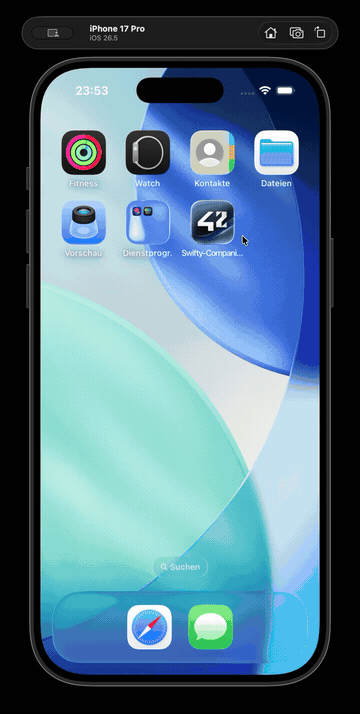

# Swifty Companion

An iOS app for looking up 42 students. Search by intra login, get the profile.

Built with SwiftUI and the 42 intra API. 42 School project, scored 110/100 (Max inc. Bonus).

## Demo



## Setup

You need Xcode 26 and iOS 26.5 or newer on the simulator or device.

Register an application on the [42 intra](https://profile.intra.42.fr/oauth/applications)
to get a client ID and secret. Then:

```bash
git clone https://github.com/t-ecker/42-SwiftyCompanion.git
cd 42-SwiftyCompanion
cp .env.example .env
```

Put your credentials in `.env`:

```
CLIENT_ID = your_client_id
CLIENT_SECRET = your_client_secret
```

Open `Swifty-Companion.xcodeproj` and run

## How it works

```
Swifty-Companion/
├── Config.swift          .env parser
├── models/               UserData, Token, SearchState, errors
├── services/
│   ├── AuthService.swift OAuth2, token cache
│   └── ApiService.swift  requests, status handling
└── features/
    ├── search/           search screen and view model
    └── profile/          profile screen and its tabs
```

- `AuthService` and `ApiService` split the networking: one keeps a valid OAuth
  token, the other makes the requests and decodes what comes back
- `AuthService` is an actor, so parallel searches cannot each start their own
  token refresh. The first stores its task and the rest await it
- Every HTTP status maps to a custom error, which the search screen shows as an
  alert
- `UserData` flattens the raw API response into the one model the views work
  with
- One navigation stack drives the app, selecting a user pushes their profile
- Recent lookups stay in a list, so a profile can be reopened without searching
  again, or cleared from the toolbar, a bonus on top of the subject
